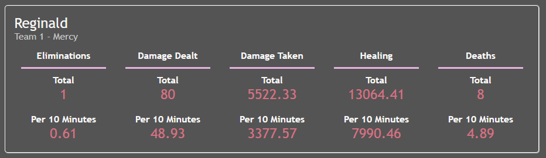
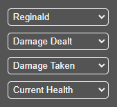
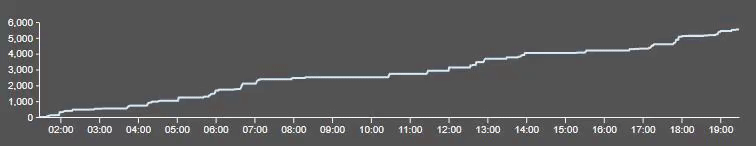
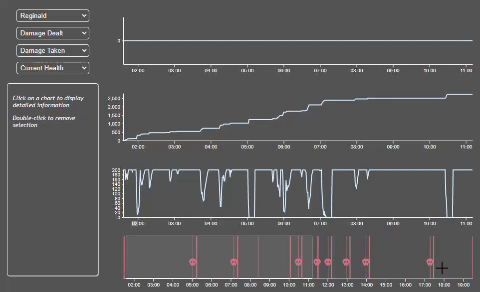

## User Guide

### Single Value Statistics

### Line Charts

#### Statistic Selection

#### Hovering

#### Set Marker

### Timeline

#### Brushing

### Map

#### Connection with Line Charts

## FAQ

1. How is this data collected?

> Anyone can collect their own data by using the Overwatch 2 lobby code: 5JWFF
> This special game mode saves log files of second by second data for each game played.
> The log files are processed by a python script and made into JSON that is used by the tool.

2. Can I upload my own scrim data?

> Currently SNACE doesn't support users uploading their own log files, but it is a functionality that we are looking to add in the near future

3. Is SNACE just for Overwatch 2?

> Right now SNACE only shows visualizations for Overwatch 2 data. We have talked about adding other games, but right now we don't have the ability to collect log data from any other games.
