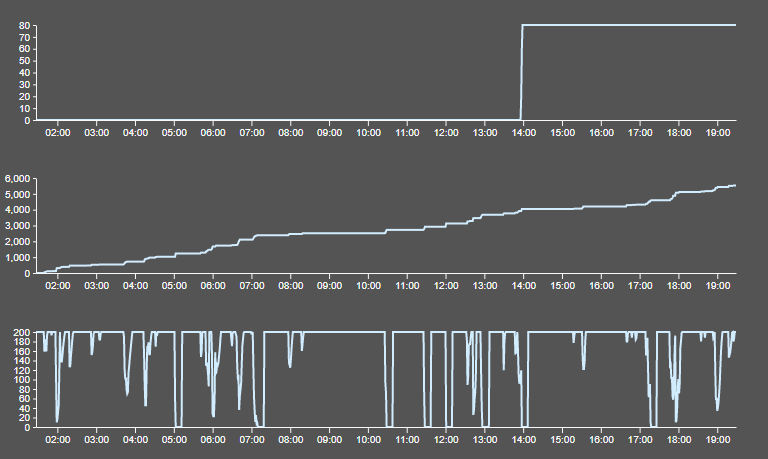
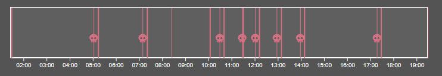
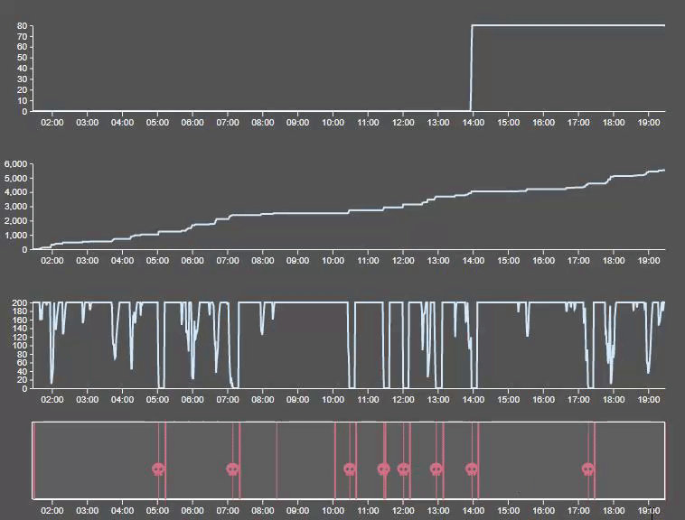
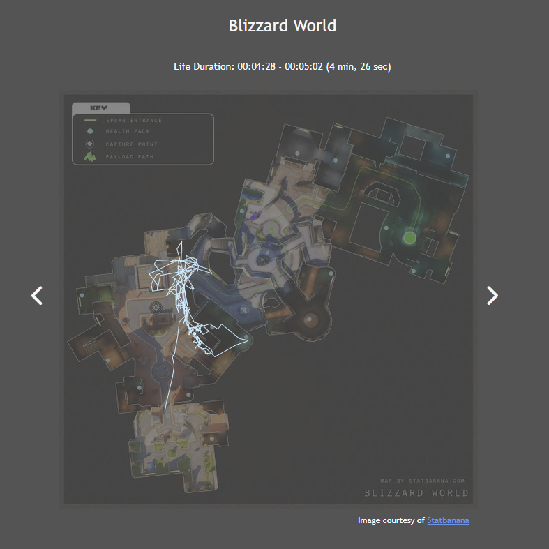
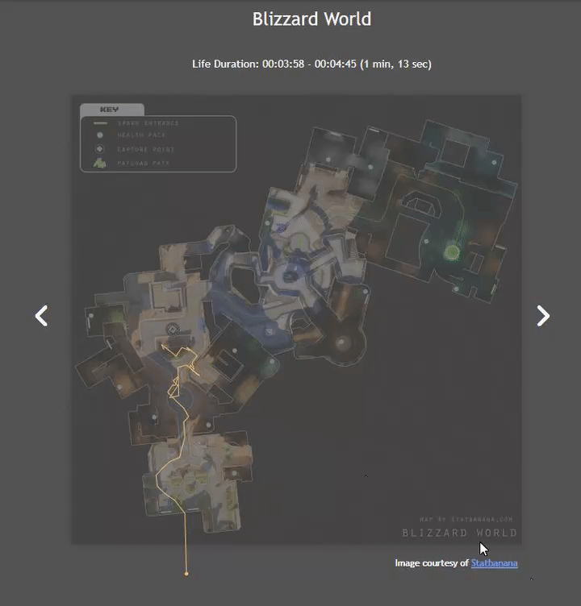
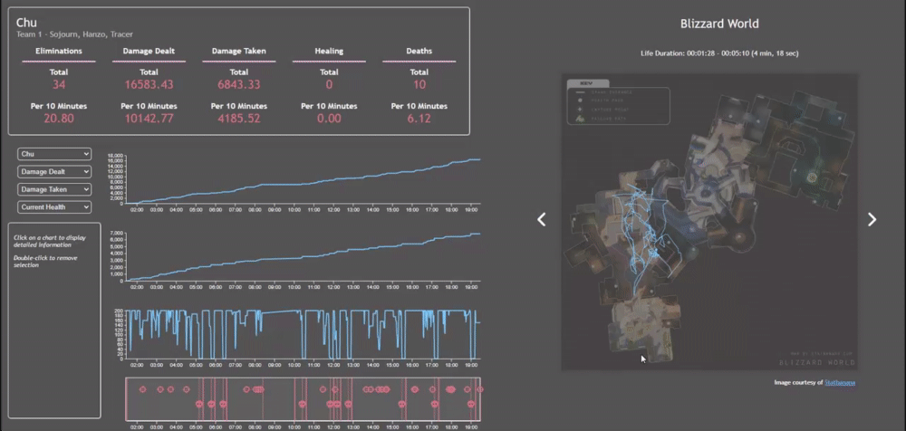

## User Guide

### Single Value Statistics

The most basic visualization that SNACE offers is the Single Value Statitics. These are values that only change based on the selected player.

### Line Charts

SNACE includes 3 customizable line charts for the user to view cumulative statistics for a player throughout the duration of the match. Each line chart has a corresponding statistic selection.

#### Hovering

The user can hover over the line charts to see their exact value at each timestamp.

#### Set Marker

Additionally, the user can set one marker that they can use to compare calues as they hover the line charts.

### Timeline

There is also a timeline to provide extra utility to the line charts. The timeline includes symbols for final blows (crosshair) and deaths (skull). The timeline also includes line markers for the start (thicker line) and the end (thinner line) of each life

#### Brushing

The timeline can be brushed through to limit the time span that is shown on each line chart.

### Map

The map visualization shows a player's movements throughout each of their lives in the match.

#### Clicking Through Lives

Using the arrow buttons, the user can click through each life to view them individually. Above the map, the duration of the currently displayed life is shown.

#### Connection with Line Charts

Hovering over any timestamp in the line charts also updates the map. For the timestamp that is being hovered, the postitions of each player in the match are shown on the map view.

## FAQ

1. How is this data collected?

> Anyone can collect their own data by using the Overwatch 2 lobby code: 5JWFF
> This special game mode saves log files of second by second data for each game played.
> The log files are processed by a python script and made into JSON that is used by the tool.

2. Can I upload my own scrim data?

> Currently SNACE doesn't support users uploading their own log files, but it is a functionality that we are looking to add in the near future

3. Is SNACE just for Overwatch 2?

> Right now SNACE only shows visualizations for Overwatch 2 data. We have talked about adding other games, but right now we don't have the ability to collect log data from any other games.
